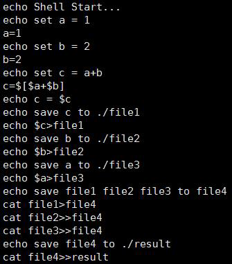
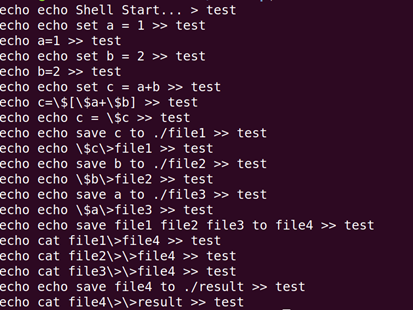
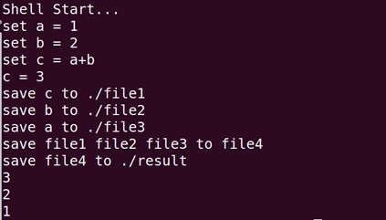

# 一、实验思考题

## Think 0.1

> 通过你的使用经验，简单分析CLI Shell，GUI Shell 在你使用过程中的各自优劣（100 字以内）

GUI Shell操作简单，容易上手，界面友好，适合普通用户使用，但占用系统资源较多，操作时效率较低。

CLI Shell更加节省，更加稳定，系统资源，操作更加高效，特别适合服务器系统和专业人员，但操作比较复杂，界面单一，对初学者不友好。

## Think 0.2

> 使用你知道的方法（包括重定向）创建下图内容的文件（文件命名为test），将创建该文件的命令序列保存在command 文件中，并将test 文件作为批处理文件运行，将运行结果输出至result 文件中。给出command 文件和result 文件的内容，并对最后的结果进行解释说明（可以从test 文件的内容入手）
>
> 

command文件内容：



result 文件内容：



test文件主要执行的命令为令a=1,b=2,计算c=a+b的值，然后将c、b、a分别存入三个文件再将这三个文件的内容存入file4文件中，最后将file4的内容追加输入到result文件，result文件中前面部分为test中使用echo打印出的字符串，最后三个数则为file4的内容追加输入到result文件的内容。

## Thinking 0.3

> 仔细看看这张图，思考一下箭头中的add the file 、stage the file 和commit 分别对应的是Git 里的哪些命令呢？
>
> 

Add the file : git add, git commit

Stage the file : git add

Commit : git commit

## Thinking 0.4

> - 深夜，小明在做操作系统实验。困意一阵阵袭来，小明睡倒在了键盘上。等到小明早上醒来的时候，他惊恐地发现，他把一个重要的代码文件printf.c 删除掉了。苦恼的小明向你求助，你该怎样帮他把代码文件恢复呢？
>
> - 正在小明苦恼的时候，小红主动请缨帮小明解决问题。小红很爽快地在键盘上敲下了git rm printf.c，这下事情更复杂了，现在你又该如何处理才能弥补小红的过错呢？
> -  处理完代码文件，你正打算去找小明说他的文件已经恢复了，但突然发现小明的仓库里有一个叫Tucao.txt，你好奇地打开一看，发现是吐槽操作系统实验的，且该文件已经被添加到暂存区了，面对这样的情况，你该如何设置才能使Tucao.txt 在不从工作区删除的情况下不会被git commit 指令提交到版本库？

（1）如果还没有git add，可以使用git checkout -- printf.c恢复

如果已经git add，可以使用git checkout HEAD printf.c恢复

（2）直接使用git checkout HEAD printf.c恢复

（3）使用git rm --cached Tucao.txt从暂存区删除

## Thinking 0.5

> 思考下面四个描述，你觉得哪些正确，哪些错误，请给出你参考的资料或实验证据。
> 1. 克隆时所有分支均被克隆，但只有HEAD 指向的分支被检出。
> 2. 克隆出的工作区中执行git log、git status、git checkout、git commit 等操作
>   不会去访问远程版本库。
> 3. 克隆时只有远程版本库HEAD 指向的分支被克隆。
> 4. 克隆后工作区的默认分支处于master 分支。

1. 正确，在克隆一个版本库时，会将远程分支都复制到目录.git/refs/remotes/origin/下。但只有默认HEAD指向的分支（master）被检出，所以在实验中需通过git checkout切换不同的labx。

2. 正确，git log、git status、git checkout、git commit等操作都是对本地库的基本操作。

3. 错误，原因同1。

4. 正确，原因同1。

参考资料：

<https://git-scm.com/docs/git-clone>

<http://blog.csdn.net/zzs2236880913/article/details/75043030?locationNum=10&fps=1>

<http://blog.csdn.net/u014785687/article/details/69357838>

# 二、实验难点

在本次实验中，难点是对于git的使用，尤其是对于git的四种文件状态，工作区、暂存区、版本库这“三棵树”以及远程仓库之间关系的理解，还有掌握常用的操作命令。下面的图示很形象地展示了他们之间的关系，有助于理解。


# 三、体会与感想

# 四、指导书反馈

在本次实验的学习中，发现指导书在以下几处细节还有待改进：

（1）在指导书第19页中，

> 我们在下载软件的时候常常会我们在考虑暂存区和版本库的关系的时候，可以粗略地认为暂存区是开发版，而版本库可以认为是稳定版，而 commit 其实就是将稳定版版本升到当前开发版的一个操作。
>

此处第一句话应该是丢失了一部分内容，造成语义不通。

（2）在第19页中，Pro Git电子书的链接无法直接下载，推荐改为

官网<https://git-scm.com/book/zh/v2>

或者<https://www.gitbook.com/book/bingohuang/progit2/details>

（3）在第22页中，

> ```shell
> # 创建一个基于当前分支产生的分支，其名字为 <branch-name>
> $ git branch -d(D) <branch-name>
> ```

该命令应该为删除分支操作，此处注释有误。

 